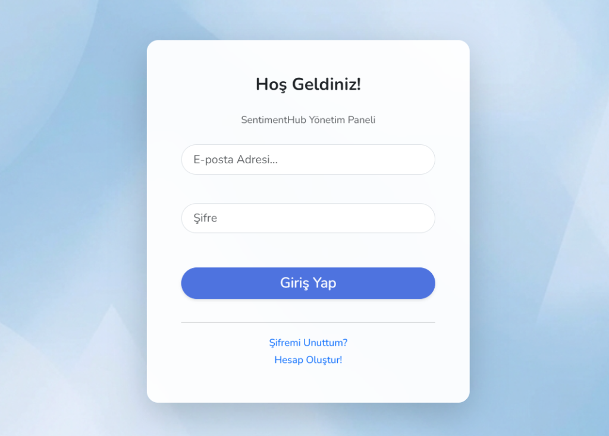
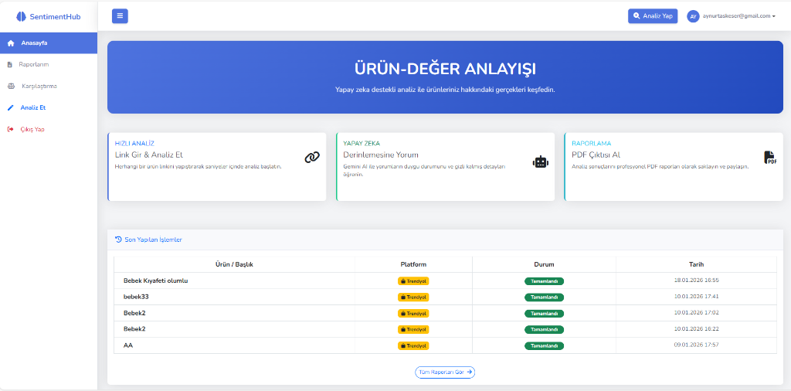
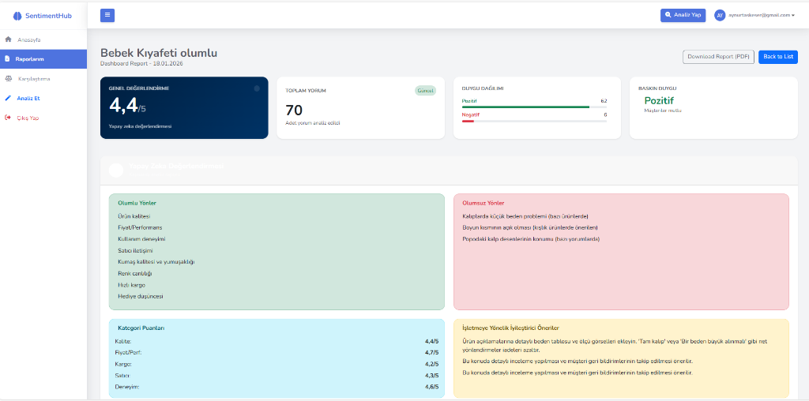
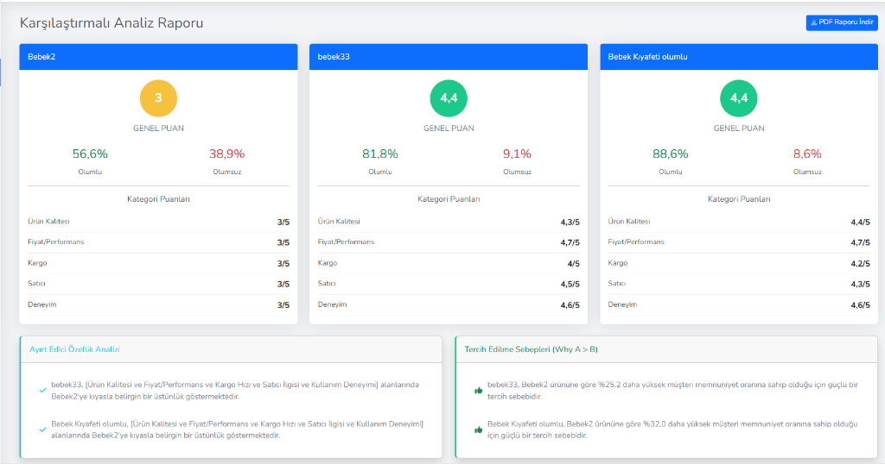
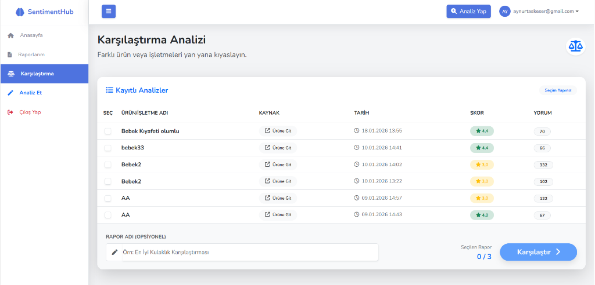

# Sentiment Hub

## 🚀 Proje Hakkında

**SentimentHub**, e-ticaret platformlarındaki (Trendyol, Hepsiburada, Amazon vb.) kullanıcı geri bildirimlerini **Doğal Dil İşleme (NLP)** ve **Büyük Dil Modelleri (LLM)** kullanarak analiz eden yeni nesil bir pazar araştırma aracıdır.

Piyasadaki standart veri kazıma araçlarının aksine, SentimentHub sadece veriyi toplamakla kalmaz; **LM Studio** entegrasyonu sayesinde bu veriyi yerel yapay zeka modelleriyle işleyerek derinlemesine anlamlandırır. Bu sayede işletmeler, ürünleri hakkında müşterilerin *gerçekte* ne düşündüğünü, hangi özelliklerin (Kargo, Fiyat, Kalite) öne çıktığını ve rekabet avantajlarını saniyeler içinde görebilir.

## 🧠 Yapay Zeka Altyapısı (LLM Studio)

Bu projenin kalbinde, verilerin gizliliğini koruyarak ve API maliyeti oluşturmadan çalışan **Yerel LLM (Local Large Language Model)** mimarisi yatar.

*   **LM Studio Entegrasyonu:** Proje, **LM Studio** üzerinden servis edilen açık kaynaklı modellerle (Llama 3, Mistral, Gemma vb.) haberleşir.
*   **Maliyet Etkin:** OpenAI veya Cloud API'lerine bağımlı olmadan, tamamen yerel donanım üzerinde çalışır.
*   **Özelleştirilebilir Prompt Mühendisliği:** Yorumları analiz etmek için özel olarak tasarlanmış "Chain-of-Thought" (Düşünce Zinciri) promptları kullanılır.
*   **Hibrit Yapı:** İstenildiğinde Python tabanlı NLP kütüphaneleri (NLTK, TextBlob) ile LLM sonuçları çapraz doğrulanır.

## ✨ Temel Özellikler

### 🔍 Akıllı Veri Toplama (Smart Scraping)
*   Dinamik web sitelerinden (SPA) veri çekebilen, bot korumalarını aşabilen gelişmiş Python/Selenium tabanlı kazıyıcılar.
*   Ürün varyantlarını ve sayfalandırmayı otomatik algılama.

### 📊 Detaylı Duygu Analizi (Aspect-Based Sentiment Analysis)
Yorumları sadece "İyi" veya "Kötü" olarak etiketlemez. Yorumun **hangi konuda** olduğunu anlar:
*   *"Ürün harika ama kargo çok geç geldi."*
    *   ✅ **Ürün Kalitesi:** Pozitif
    *   ❌ **Kargo:** Negatif

### 📈 Karşılaştırmalı Rekabet Analizi
*   İki farklı ürünü veya markayı yan yana koyarak "Neden A ürünü B ürününden daha iyi?" sorusuna veriye dayalı yanıtlar verir.
*   SWOT analizi (Güçlü/Zayıf Yönler) benzeri otomatik raporlar üretir.

### 🛡️ Güvenlik ve Kimlik Doğrulama
*   **ASP.NET Core Identity** ile kurumsal seviyede üyelik sistemi.
*   **OTP (One-Time Password)** ile e-posta doğrulama (Gmail SMTP entegrasyonu).

## 🛠️ Teknik Mimari

Proje, Sürdürülebilirlik ve Performans odaklı modern bir teknoloji yığını ile geliştirilmiştir:

| Alan | Teknoloji | Açıklama |
|---|---|---|
| **Backend** | .NET 8.0 (Core) | Yüksek performanslı RESTful API ve MVC yapısı. |
| **AI Engine** | **LM Studio** | Yerel LLM sunucusu ve Inference motoru. |
| **Data Scripting** | Python 3.11 | Selenium, BeautifulSoup ve Pandas ile veri işleme. |
| **Database** | MS SQL Server | İlişkisel veri modelleme ve Entity Framework Core ORM. |
| **Frontend** | Bootstrap 5 & JS | Responsive, dashboard odaklı modern arayüz. |
| **Reporting** | iText7 | Dinamik PDF rapor oluşturma motoru. |

## 📷 Projeden Kareler

SentimentHub'ın kullanıcı dostu arayüzü, karmaşık verileri anlaşılır grafiklere dönüştürür.

| Giriş ve Kayıt | Dashboard |
|:---:|:---:|
|  |  |

| Analiz Detayları | Karşılaştırma Raporu |
|:---:|:---:|
|  |  |

| Kayıtlı Analizler | |
|:---:|:---:|
|  | |

## 🚀 Kurulum ve Çalıştırma

1.  **Gereksinimler:**
    *   .NET 8.0 SDK
    *   Python 3.10+
    *   LM Studio (Yerel sunucusu 1234 portunda çalışmalı)
    *   SQL Server

2.  **Projeyi Klonlayın:**
    ```bash
    git clone https://github.com/KULLANICI_ADI/SentimentHub.git
    ```

3.  **Veritabanını Güncelleyin:**
    ```bash
    dotnet ef database update
    ```

4.  **Uygulamayı Başlatın:**
    ```bash
    dotnet run
    ```

---
Bu proje **Mekselina Taşkeser** tarafından geliştirilmiştir.
*Veri odaklı karar alma süreçlerini yapay zeka ile demokratikleştiriyoruz.*


