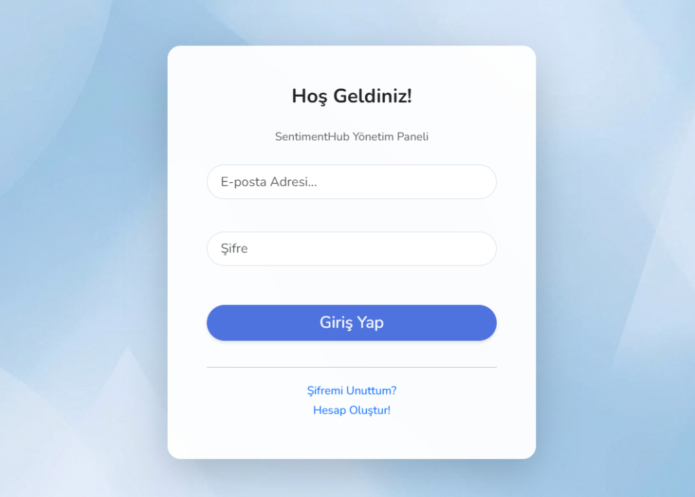
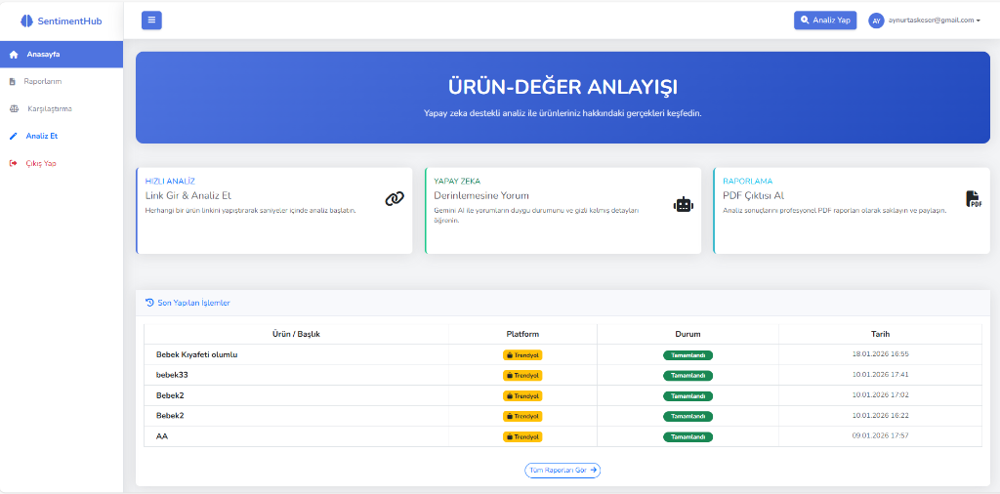
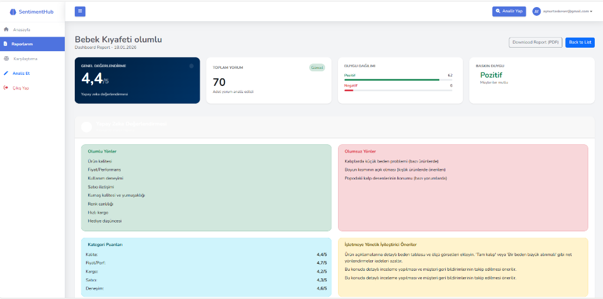
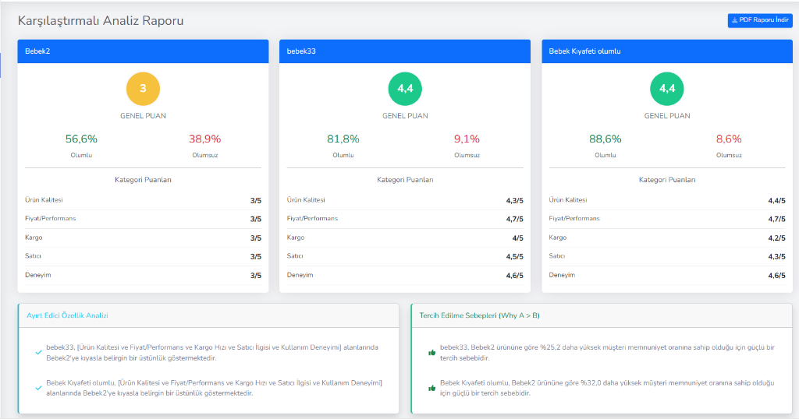
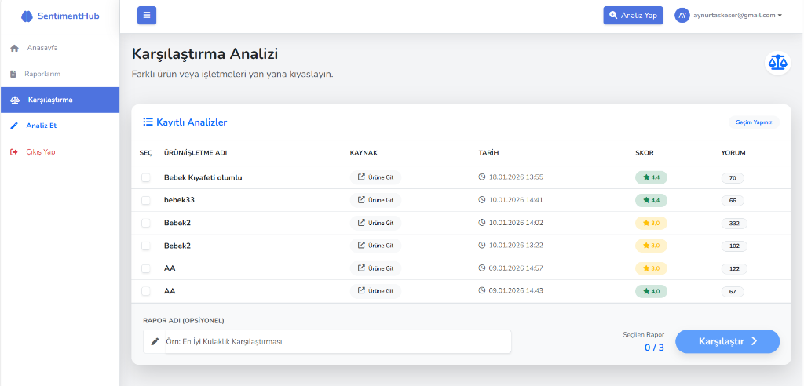

# Web Tabanlı Programlama Dersi – Final Projesi: SentimentHub

## Proje Amacı
Bu projenin temel amacı, e-ticaret sitelerinde yer alan ürün yorumlarını otomatik olarak toplayıp, yapay zeka destekli duygu analizi (Sentiment Analysis) yöntemleriyle işleyerek kullanıcıya anlamlı veriler sunmaktır. 
**Not:** Proje kapsamı şu an için **sadece Trendyol** platformuna minimize edilmiştir. Trendyol üzerindeki ürün yorumları çekilerek analiz edilmektedir.

Bu sayede, binlerce yorumu tek tek okumak yerine, ürün hakkındaki genel kanı, en çok beğenilen ve eleştirilen yönler hızlıca anlaşılabilir hale gelmektedir. Proje; MVC mimarisini, C# programlama dilini ve veritabanı entegrasyonunu gerçek hayat senaryosunda uygulayarak modern bir web çözümü sunar.

## Hedef Kullanıcı Kitlesi
Bu web uygulaması aşağıdaki kitlelere hitap etmektedir:
*   **Online Alışveriş Yapanlar:** Satın almayı düşündükleri ürün hakkında hızlı ve özet bilgi almak isteyen son kullanıcılar.
*   **E-Ticaret Satıcıları:** Sattıkları veya rakip ürünlerin müşteri geri bildirimlerini analiz ederek ürünlerini geliştirmek isteyen işletmeler.
*   **Pazar Analistleri:** Belirli kategorilerdeki müşteri memnuniyetini ve trendleri ölçmek isteyen araştırmacılar.

## Senaryo / Kullanım Amacı
Uygulama şu senaryoda kullanılır:
1.  **Giriş/Kayıt:** Kullanıcı sisteme üye olur veya giriş yapar (Email doğrulama opsiyonu ile).
2.  **Veri Girişi:** Kullanıcı, analiz etmek istediği ürünün **Trendyol** linkini sisteme yapıştırır.
3.  **Veri Toplama ve Analiz:** Sistem arka planda ilgili linkteki yorumları çeker ve **LM Studio** üzerinden çalışan yerel LLM (Large Language Model) modellerini kullanarak her yorumu "Olumlu", "Olumsuz" veya "Nötr" olarak sınıflandırır. Ayrıca yorumlardan anahtar kelimeler ve konu başlıkları çıkarır.
4.  **Raporlama:** Analiz tamamlandığında kullanıcıya görsel grafikler, duygu dağılım oranları ve özet bilgiler içeren detaylı bir rapor sayfası sunulur.
5.  **Karşılaştırma:** Kullanıcılar farklı ürünlerin analiz sonuçlarını kaydedebilir ve bunları karşılaştırabilir.

## Kullanılan Teknolojiler
Proje geliştirme sürecinde aşağıdaki teknoloji ve araçlar kullanılmıştır:

*   **Programlama Dili:** C#
*   **Framework:** ASP.NET Core MVC
*   **Veritabanı:** SQL Server Express (Veritabanı işlemleri CRUD mantığı ile tam uyumlu olarak gerçekleştirilmiştir)
*   **ORM:** Entity Framework Core
*   **Yapay Zeka ve Veri İşleme:** 
    *   **Python** (Veri kazıma/Scraping için)
    *   **LM Studio** (Yerel LLM servisi ile Sentiment Analizi için)
*   **Frontend:** HTML5, CSS3, JavaScript, Bootstrap (Responsive/Duyarlı Tasarım)

## GitHub Repository Yapısı
Proje, MVC (Model-View-Controller) mimarisine uygun olarak geliştirilmiş olup aşağıdaki temel klasör yapısına sahiptir:

*   `📁 Controllers/`: Uygulamanın iş mantığını ve akışını yöneten kontrolcü sınıfları.
*   `📁 Models/`: Veritabanı tablolarını ve iş nesnelerini temsil eden sınıflar.
*   `📁 Views/`: Kullanıcı arayüzünü oluşturan Razor (.cshtml) sayfaları.
*   `📄 appsettings.json`: Veritabanı bağlantı cümleciği ve uygulama ayarları.
*   `📄 README.md`: Proje dokümantasyonu.

## 📷 Projeden Kareler

SentimentHub'ın kullanıcı dostu arayüzü, karmaşık verileri anlaşılır grafiklere dönüştürür.

| Giriş ve Kayıt | Dashboard |
|:---:|:---:|
|  |  |

| Analiz Detayları | Karşılaştırma Raporu |
|:---:|:---:|
|  |  |

| Kayıtlı Analizler | |
|:---:|:---:|
|  | |

## Tanıtım Videosu
Projenin detaylı tanıtımını, MVC yapısının açıklamasını ve uygulamanın çalışır halini aşağıdaki YouTube videosundan izleyebilirsiniz:

[GitHub Teslim Videosu - İzlemek İçin Tıklayın](https://www.youtube.com/watch?v=P9XJ7bf1WzM)

