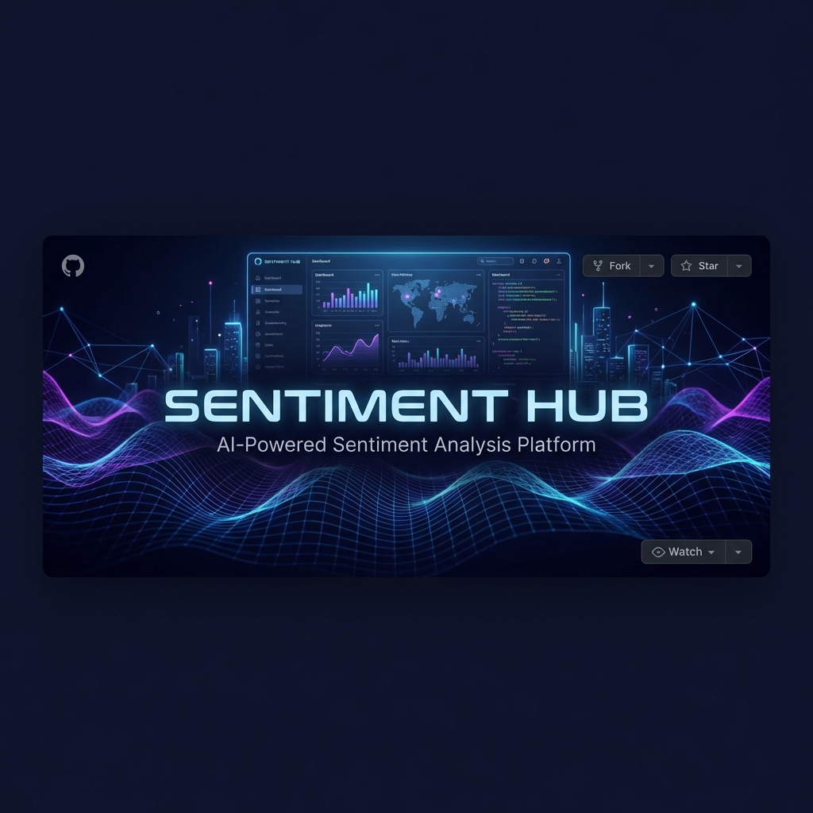

<div align="center">



# SentimentHub

**E-ticaret ürün yorumlarını yapay zekâ ile analiz eden, rakip ürünleri karşılaştıran ve işletmelere veri odaklı karar desteği sunan açık kaynaklı iş zekâsı platformu.**

<br/>

[](https://dotnet.microsoft.com/)
[](https://www.python.org/)
[](https://fastapi.tiangolo.com/)
[](https://www.sqlite.org/)
[](https://lmstudio.ai/)
[](https://www.selenium.dev/)
[](LICENSE)

</div>

---

## Genel Bakış

**SentimentHub**, Trendyol platformundaki ürün yorumlarını otomatik olarak toplayıp yerel büyük dil modeli (LLM) ile analiz eden, her yorumu duygu durumuna ve kategori etiketine göre sınıflandıran yapay zekâ destekli bir karar destek sistemidir.

Sistem yalnızca genel bir memnuniyet puanı üretmekle kalmaz; ürün kalitesi, kargo, satıcı davranışı ve fiyat/performans gibi boyutları bağımsız olarak değerlendirir. **Karşılaştırmalı İş Zekâsı Motoru** ile rakip ürünleri karşılaştırır; hangi ürünün hangi müşteri profiline daha uygun olduğunu belirler ve iş zekâsı raporları üretir.

E-ticaret satıcıları, pazar analistleri ve ürün yöneticileri için tasarlanmıştır. Tüm yapay zekâ işlemleri **yerel LLM altyapısı** üzerinde gerçekleştirilir; hiçbir yorum verisi dışarıya gönderilmez.

---

## Temel Özellikler

| Özellik | Açıklama |
|---|---|
| **Yapay Zekâ Duygu Analizi** | Her yorum LLM ile Olumlu / Olumsuz / Nötr olarak sınıflandırılır |
| **Konu Bazlı Analiz** | 5 bağımsız kategori (Kalite, Kargo, Satıcı, Fiyat, Deneyim) ayrı ayrı puanlanır |
| **Kök Neden Tespiti** | Zayıf yönler kural tabanlı motorla işlem yapılabilir önerilere dönüştürülür |
| **Risk Erken Uyarı Sistemi** | Geçmiş analizlerle kıyaslamalı 3 seviyeli risk uyarısı üretilir |
| **Fiyat Algısı Analizi** | Fiyat/Performans kategorisi bazlı müşteri algısı ölçülür |
| **Tavsiye Etme Eğilimi** | NPS mantığıyla tavsiye etme eğilimi hesaplanır |
| **Müşteri Sadakati Analizi** | Yorum metinlerinde tekrar satın alma sinyalleri taranır |
| **Karşılaştırmalı İş Zekâsı** | 2–3 ürün karar güven skoru ve persona uyumuyla karşılaştırılır |
| **PDF Raporlama** | Analiz ve karşılaştırma raporları indirilebilir PDF formatında sunulur |

---

## Ekran Görüntüleri

### Giriş Sayfası


---

### Kontrol Paneli


---

### Analiz Raporu


---

### Müşteri Yorumları


---

### Karşılaştırmalı İş Zekâsı Motoru


---

### Persona Uyumu ve Karar Zekâsı

> *Ekran görüntüleri eklenecek.*

---

## Nasıl Çalışır?

```
  Trendyol Ürün URL'si girilir
          ↓
  Selenium WebDriver ile otomatik yorum kazıma
          ↓
  Temizleme ve tekrar yorum tespiti
          ↓
  LLM ile duygu sınıflandırması  (Olumlu / Olumsuz / Nötr)
          ↓
  Konu sınıflandırması  (Kalite / Kargo / Satıcı / Fiyat / Deneyim)
          ↓
  Zenginleştirme Katmanı
  (Kök Neden · Risk Uyarısı · Fiyat Algısı · Tavsiye · Sadakat)
          ↓
  Karşılaştırmalı İş Zekâsı Motoru
          ↓
  Kontrol Paneli · Grafikler · PDF Rapor
```

---

## Teknoloji Yığını

### Arka Uç

| Teknoloji | Sürüm | Kullanım Amacı |
|---|---|---|
| C# / ASP.NET Core MVC | .NET 8 | Web uygulama çerçevesi |
| Entity Framework Core | 8.0 | ORM ve veritabanı yönetimi |
| ASP.NET Identity | 8.0 | Kimlik doğrulama |
| SQLite | — | Yerleşik veritabanı |
| MailKit / SMTP | — | E-posta doğrulama |
| PdfService | — | PDF rapor oluşturma |

### Yapay Zekâ Mikro Servisi

| Teknoloji | Sürüm | Kullanım Amacı |
|---|---|---|
| Python | 3.11 | Mikro servis dili |
| FastAPI + Uvicorn | 0.111 / 0.29 | REST API sunucusu |
| Selenium WebDriver | 4.21 | Web otomasyon |
| BeautifulSoup4 | 4.12 | HTML ayrıştırma |
| OpenAI Python SDK | 1.30 | LM Studio protokolü |

### Yapay Zekâ Altyapısı

| Araç | Kullanım Amacı |
|---|---|
| LM Studio | Yerel LLM sunucusu (`localhost:1234`) |
| OpenAI-uyumlu API | LM Studio iletişim katmanı |
| BERT (Yedek) | LLM erişimi olmadığında yedek sınıflandırıcı |

### Ön Uç

| Teknoloji | Kullanım Amacı |
|---|---|
| HTML5 / CSS3 / Bootstrap 5 | Duyarlı arayüz |
| JavaScript | Etkileşim katmanı |
| Chart.js | Grafik ve görselleştirme |

---

## Sistem Mimarisi

```
┌──────────────────────────────────────────────────────────┐
│                        KULLANICI                         │
└───────────────────────────┬──────────────────────────────┘
                            │ HTTPS
                            ▼
┌──────────────────────────────────────────────────────────┐
│            SentimentHub.Web  —  ASP.NET Core MVC         │
│                                                          │
│  Kontrolcüler             Servisler          Görünümler  │
│  ─────────────            ──────────         ─────────── │
│  Hesap                    LmStudioService    Razor Pages │
│  Analiz                   ZenginleştirmeS.   Kontrol Pan.│
│  Karşılaştırma            ÖneriMotoru        Raporlar    │
│  AnaSayfa                 PdfServisi         Karşılaştır.│
│                           PythonApiServisi               │
│                           EpostaGönderici                │
│                                                          │
│  ┌────────────────────────────────────────────────────┐  │
│  │       Entity Framework Core  +  SQLite             │  │
│  │  Kullanıcı · İşletme · Analiz · Yorum · Rapor     │  │
│  └────────────────────────────────────────────────────┘  │
└──────────────────────────┬───────────────────────────────┘
                           │ HTTP — localhost:8001
                           ▼
┌──────────────────────────────────────────────────────────┐
│          SentimentHub.AI  —  Python / FastAPI            │
│                                                          │
│   scraper.py                    sentiment.py             │
│   Selenium + BS4                OpenAI-uyumlu İstemci   │
│   Başsız Chrome                 İstem Mühendisliği       │
└──────────────────────────┬───────────────────────────────┘
                           │ OpenAI-uyumlu REST API
                           ▼
               ┌───────────────────────────┐
               │         LM Studio         │
               │   localhost:1234/v1/       │
               └───────────────────────────┘
```

---

## Yapay Zekâ İşlem Hattı

```
1. Yorum metni alınır
2. LmStudioService → POST /v1/chat/completions
   sıcaklık=0.1  |  maks_token=100  |  akış=kapalı
3. Çıktı: { duygu, kategori, puan }
4. Toplu özet → GenerateSummaryAsync  (ilk 50 yorum)
   Güçlü yönler · Zayıf yönler · 5 kategori puanı
5. ZenginleştirmeServisi devreye girer
6. ÖzetJson olarak veritabanına kaydedilir
```

LLM yanıtı Markdown içeriyorsa temizlenir. Ayrıştırma hatasında güvenli yedek devreye girer (`Nötr / GenelMemnuniyet / Puan: 3`).

---

## Zenginleştirme Servisi (AnalysisEnrichmentService)

Ham LLM çıktısını beş katmanlı stratejik veriyle zenginleştiren merkezi servis. Analiz tamamlandıktan sonra sırayla çalışır.

---

### Kök Neden Analizi

LLM'in ürettiği zayıf yönler, `ÖneriMotoru` içindeki kural tabanlı motordan geçirilir. Anahtar kelime eşleştirmesiyle (kargo, fiyat, kalite, iade vb.) her zayıf yöne karşılık **işlem yapılabilir** bir iyileştirme önerisi üretilir.

---

### Risk Erken Uyarı Sistemi

Mevcut analiz, aynı ürünün önceki analiz sonuçlarıyla karşılaştırılır.

| Seviye | Tetikleyici Koşul |
|---|---|
| **Yüksek / Kritik** | Puan düşüşü ≥ 0.5 veya olumsuz artış ≥ %15 |
| **Orta / Dikkat** | Puan düşüşü ≥ 0.2 veya olumsuz artış ≥ %5 |
| **Düşük / Takip** | Herhangi bir metrikte pozitif sapma |
| **Kararlı** | Tüm metrikler stabil |

İlk analizde mutlak olumsuz yorum oranı baz alınır.

---

### Fiyat Algısı Analizi

`FiyatPerformans` kategorisindeki yorum yoğunluğu ve duygu dağılımı analiz edilerek fiyat/performans algı skoru (1.0–5.0) hesaplanır. Karşılaştırma motorunda fark değerine dönüştürülür.

---

### Tavsiye Etme Eğilimi Analizi

NPS mantığıyla üç segment hesaplanır: **Destekleyen / Kararsız / Olumsuz**.  
Tavsiye skoru `maks(0, min(100, Destekleyen%))` formülüyle türetilir.  
Yorum sayısına göre güven düzeyi atanır: Yüksek (≥10) · Orta (5–9) · Düşük (<5).

---

### Müşteri Sadakati Analizi

Yorum metinlerinde düzenli ifade taramasıyla tekrar satın alma sinyalleri tespit edilir (`"tekrar aldım"`, `"favorim"`, `"aylardır"` vb.).

- **Güçlü:** ≥ 5 sinyal
- **Orta:** 2–4 sinyal
- **Zayıf:** < 2 sinyal

---

## Karşılaştırmalı İş Zekâsı Motoru

2–3 ürün analizini sistemli biçimde karşılaştırarak iş zekâsı çıktıları üretir.

---

### Kazanan Tespiti

`GenelPuan` karşılaştırması ile kazanan belirlenir.

| Fark | Sonuç |
|---|---|
| ≥ 0.5 | Belirgin Üstünlük |
| 0.2 – 0.49 | Yakın Rekabet |
| < 0.2 | Beraberlik |

---

### Karar Güven Skoru

Üç bileşenden türetilen bileşik güven skoru:
- Puan farkı etkisi
- Kategori dominansı (kaç kategoride önde olunduğu)
- Duygu tutarlılığı

---

### Kategori Fark Analizi

Her kategori için iki ürün arasındaki puan farkı (Δ) hesaplanır.

- `|Δ| ≥ 1.0` → Ayırt Edici Fark
- `|Δ| ≥ 0.5` → Yüksek Ağırlık
- `|Δ| < 0.5` → Orta Ağırlık

---

### Alıcı Persona Uyumu

| Müşteri Profili | Belirleyici Kategori |
|---|---|
| Premium Alıcı | Ürün Kalitesi + Kullanıcı Deneyimi |
| Fiyat/Performans Alıcısı | Fiyat / Performans |
| Hızlı Kargo Alıcısı | Kargo ve Teslimat |
| Güvenilir Satıcı Alıcısı | Satıcı / Paketleme |
| Uzun Vadeli Kullanıcı | Genel Ortalama |

---

### Geçiş Öngörüsü ve Karar Gerekçesi

Kaybeden ürünün kullanıcılarının kazanana geçişte elde edeceği avantajlar listelenir. Kazanan ürünün güçlü kategorileri, puan üstünlüğü ve duygu farkı temel alınarak yazılı bir **karar gerekçesi** üretilir.

---

## Veritabanı Yapısı

```
KullanıcıHesabı  (ASP.NET Identity)
  │
  └── İşletme  (1:N)
        │  SahibiId, Ad, ÜrünUrl, OluşturulmaZamanı
        │
        └── Analiz  (1:N)
              │  Tarih, Durum, ToplamYorum, GenelPuan
              │  ÖzetJson  ←  ZenginleştirmeServisi çıktısı
              │
              └── Yorum  (1:N)
                    │  Metin, YazarAdı, YorumTarihi, YıldızPuanı
                    │  DuyguDurumu  (Olumlu / Olumsuz / Nötr)
                    │  GüvenSkoru
                    │
                    └── KonuSonucu  (1:N)
                          Konu  (ÜrünKalitesi / FiyatPerformans /
                                 Kargo / SatıcıPaketleme /
                                 GenelMemnuniyet)
                          DuyguDurumu, Güven

KarşılaştırmaRaporu  (Bağımsız)
  AnalizIdleri  ←  JSON dizi: "[1, 5, 8]"
  SonuçJson    ←  KarşılaştırmaGörünümModeli (JSON)
  Ad, OluşturulmaZamanı
```

---

## Proje Klasör Yapısı

```
SentimentHub/
├── SentimentHub/
│   ├── SentimentHub.Web/               ASP.NET Core MVC
│   │   ├── Controllers/
│   │   │   ├── AccountController.cs    Kayıt · Giriş · E-posta Doğrulama
│   │   │   ├── AnalysisController.cs   Analiz Yönetimi · Raporlama
│   │   │   ├── ComparisonController    Karşılaştırma Motoru · PDF
│   │   │   └── HomeController.cs
│   │   ├── Models/                     Varlık Modelleri + Sabit Değerler
│   │   ├── Services/
│   │   │   ├── LmStudioService.cs      LLM API Entegrasyonu
│   │   │   ├── AnalysisEnrichmentService   5 Katmanlı Zenginleştirme
│   │   │   ├── RecommendationEngine    Kural Tabanlı Öneri Motoru
│   │   │   ├── PdfService.cs           PDF Oluşturma
│   │   │   ├── PythonApiService.cs     Yapay Zekâ Servis İstemcisi
│   │   │   └── EmailSender.cs          SMTP
│   │   ├── Views/                      Razor Şablonları
│   │   ├── Data/                       VeritabanıBağlamı
│   │   └── DTOs/                       Veri Transfer Nesneleri
│   │
│   └── SentimentHub.AI/                Python Mikro Servisi
│       ├── main.py                     FastAPI Yönlendirici
│       ├── scraper.py                  Selenium Kazıyıcı
│       ├── sentiment.py                LM Studio İstemcisi
│       └── requirements.txt            Python Bağımlılıkları
│
├── docs/screenshots/                   Ekran Görüntüleri
├── validation_dataset/                 Model Doğrulama Veri Seti
├── analyze_findings.py                 Bulgu Analiz Betiği
├── generate_validation_dataset.py      Veri Seti Üretici
└── baslat.bat                          Windows Hızlı Başlatma
```

---

## Kurulum

### Gereksinimler

- [.NET 8 SDK](https://dotnet.microsoft.com/download/dotnet/8)
- [Python 3.11](https://www.python.org/downloads/)
- [LM Studio](https://lmstudio.ai/)
- [Google Chrome](https://www.google.com/chrome/)

---

### 1 — Depoyu Klonla

```bash
git clone https://github.com/taskesermekselina/SentimentHub.git
cd SentimentHub
```

### 2 — LM Studio Kurulumu

1. Uyumlu bir model indir *(önerilen: Llama-3-8B-Instruct veya benzeri)*
2. **Yerel Sunucu** → **Sunucuyu Başlat** düğmesine tıkla
3. `http://localhost:1234/v1` adresinde çalıştığını doğrula

### 3 — Python Yapay Zekâ Servisi

```bash
cd SentimentHub/SentimentHub.AI

python -m venv venv
venv\Scripts\activate

pip install -r requirements.txt

uvicorn main:app --host 0.0.0.0 --port 8001 --reload
```

### 4 — Web Uygulaması

```bash
cd SentimentHub/SentimentHub.Web

dotnet ef database update
dotnet run
```

Uygulama `https://localhost:5001` adresinde açılır.

> **Windows için hızlı başlatma:** `baslat.bat`

---

## Gelecek Çalışmalar

- Çoklu platform desteği (Amazon TR, Hepsiburada, n11)
- Çok dilli analiz ve otomatik dil tespiti
- Zaman serisi tabanlı memnuniyet tahmin modeli
- Gerçek zamanlı izleme ve anlık bildirim sistemi
- Gelişmiş dil modeli entegrasyonları (GPT-4, Claude, alan özgü modeller)
- Üçüncü taraf sistemler için REST API katmanı

---

## Tez Bilgisi

> **"E-Ticaret Platformlarındaki Kullanıcı Yorumlarının Yapay Zekâ ile Analizi ve Karşılaştırmalı İş Zekâsı Sistemi Geliştirilmesi: SentimentHub Uygulaması"**

| | |
|---|---|
| Üniversite | Bursa Uludağ Üniversitesi |
| Fakülte | İnegöl İşletme Fakültesi |
| Bölüm | Yönetim Bilişim Sistemleri |
| Tür | Lisans Tezi |
| Yıl | 2026 |

**Özgün Akademik Katkılar**

- `ZenginleştirmeServisi` — 5 katmanlı zenginleştirme mimarisi
- Geçmiş analiz karşılaştırmasına dayalı çok boyutlu risk tahmin yaklaşımı
- Veri gizliliği korumalı yerel büyük dil modeli altyapısı kullanımı
- Kategori fark analizi ve persona uyumuyla karşılaştırmalı iş zekâsı motoru
- NPS tabanlı tavsiye etme eğilimi hesaplama yöntemi

---

## Geliştirici

**Aynur Taşkeser Mekselina**

Bursa Uludağ Üniversitesi · İnegöl İşletme Fakültesi · Yönetim Bilişim Sistemleri

[](https://github.com/taskesermekselina)

---

<div align="center">

**SentimentHub** — Yapay Zekâ Destekli E-Ticaret Karar Destek Sistemi

</div>
